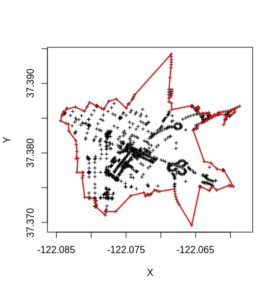
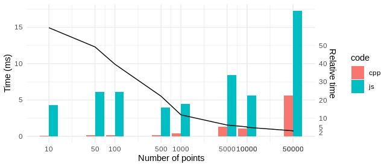

## RcppConcaveman

A very fast 2D concave hull algorithm in R

The algorithm is based on ideas from [Park and Oh (2012)](http://www.iis.sinica.edu.tw/page/jise/2012/201205_10.pdf). 

A first implementation in JavaScript was proposed by Vladimir Agafonkin in [mapbox](https://github.com/mapbox/concaveman). This implementation dramatically improved performance over the one stated in the paper (`O(rn)` to `O(n log n)`). 

The algorithm was then ported to R by Joël Gombin in the package [concaveman](https://github.com/joelgombin/concaveman). This package run the original implementation in JavaScript proposed by Vladimir Agafonkin using the `V8` library.

Later a C++ implementation of Vladimir Agafonkin's JavaScript was proposed by Stanislaw Adaszewski in [concaveman-cpp](https://github.com/sadaszewski/concaveman-cpp).

The `RcppConcaveman` package wraps the Stanislaw Adaszewski's C++ code and is a dependency free pakage.

## Example

``` r
library(RcppConcaveman)
data(points)
hull <- concaveman(points)
plot(points, asp = 1)
lines(hull, lwd = 3, col = "red")
```



## Benchmarks


